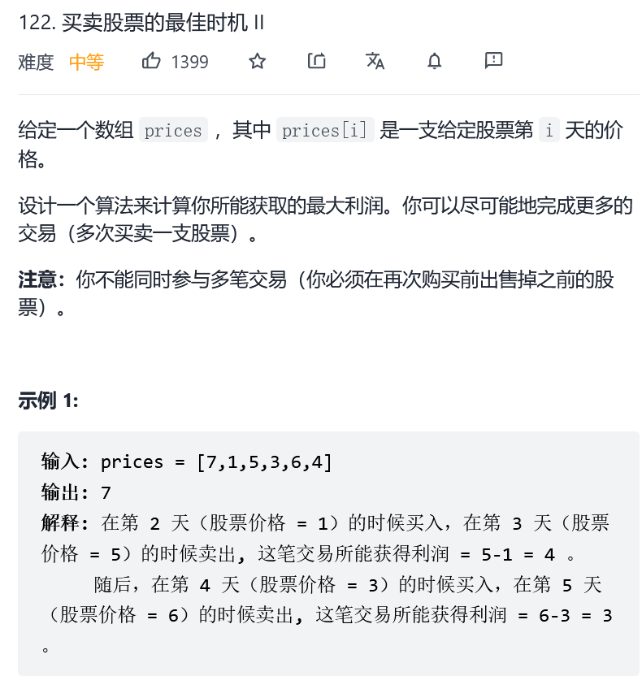

## 股票问题

### [121. 买卖股票的最佳时机](https://leetcode-cn.com/problems/best-time-to-buy-and-sell-stock/)


> 这是股票系列问题中的第一道，也是最简单的一道，只能买卖一次 

> 思路：动态规划  求解过程中需要更新两个变量 一个minPrice表示遍历到第i天时前i-1天中的最小价格  一个maxProfit表示前i-1天中可以获得的最大利润  当前可以获得的最大利润是prices[i]-minPrice  将这个值和maxProfit比较 将minPrice和prices[i]比较  然后更新

``` java
class Solution {
    public int maxProfit(int[] prices) {
        int minPrice=prices[0];//先初始化最小价格是第1天的价格
        int maxProfit=Integer.MIN_VALUE;//初始化全局最大利润
        int profit=0;//第i天可以获得的最大利润
        for(int i=1;i<prices.length;i++)
        {
            profit=prices[i]-minPrice;//第i天可以获得的最大利润
            minPrice=Math.min(minPrice,prices[i]);//更新最小价格
            maxProfit=Math.max(maxProfit,profit);//更新前i天可以获得的最大利润
        }
        if(maxProfit<0)//maxProfit<0 说明不能获利 按要求返回0
            return 0;
        else
            return maxProfit;//返回最大利润

    }
}
//O(n)  遍历一次数组
//O(1)  没有使用额外空间
```

### [122. 买卖股票的最佳时机 II](https://leetcode-cn.com/problems/best-time-to-buy-and-sell-stock-ii/)




> 这道题相较于股票问题1 本题可以多次交易   有两种思路，一是贪心，二是动态规划

> 贪心： 我们不需要考虑具体的交易过程（哪天买哪天卖） 只需要知道最后的结果即可 只要后一天的价格比前一天的价格高就卖 否则不卖 比如[1,2,3,4,5]  最后的结果是4 但是实际过程不是进行了4次交易  而是第1天买 第5天卖

``` java
class Solution {
    public int maxProfit(int[] prices) {

        int maxProfit=0;
        for(int i=1;i<prices.length;i++)
        {
            if(prices[i]-prices[i-1]>0)//今天的价格比昨天高
                maxProfit+=prices[i]-prices[i-1];
        }
        return maxProfit;
      
    }
}
//O(n)
//O(1)
```

> 动态规划：第i天交易（买or卖or不买不卖）结束后，有两种情况： 1. 手里还有股票  2. 手里没有股票  所以有这两种状态  创建一个dp数组  dp\[n][2]  dp\[i][0]表示第i天交易结束后手里**没有股票**时获得的最大利润  dp\[i][1]表示第i天交易结束后手里**有股票**时获得的最大利润   
>
> 状态方程1： dp\[i][0]=max(dp\[i-1][0],dp\[i-1][1]+prices[i])   
>
> 解释：第i天交易结束后手里**没有股票** 可能时因为第i-1天手里就已经没有股票或者第i-1天手里有一支股票  第i天卖了
>
> 状态方程2： dp\[i][1]=max(dp\[i-1][1],dp\[i-1][0]-prices[i])   
>
> 解释：第i天交易结束后手里**有股票** 可能时因为第i-1天手里就有股票或者第i-1天手里没有股票  第i天买了1支股票
>
> 由于第i天交易结束以后手里没有股票的利润一定比手里有股票的利润要大  所以返回dp\[n][0]
>
> 初始值设定： dp\[0][0]=0    dp\[0][1]=-prices[0] (买股票花了钱所以是负值)

``` java
class Solution {
    public int maxProfit(int[] prices) {

        int n=prices.length;
        int[][] dp=new int[n][2];
        dp[0][0]=0;
        dp[0][1]=-prices[0];
        for(int i=1;i<n;i++)
        {
            dp[i][0]=Math.max(dp[i-1][0],dp[i-1][1]+prices[i]);
            dp[i][1]=Math.max(dp[i-1][1],dp[i-1][0]-prices[i]);
        }
        return dp[n-1][0];
      
    }
}
//O(n)
//O(n)  2*n大小的数组空间
```

### [123. 买卖股票的最佳时机 III](https://leetcode-cn.com/problems/best-time-to-buy-and-sell-stock-iii/)


> 解题思路：动态规划  对于第i天结束时，可能有以下5中状态：
>
> 1. 未持股，未卖出过股票
> 2. 未持股，卖出过1次股票
> 3. 未持股，卖出过2次股票
> 4. 持股，未卖出过股票
> 5. 持股，卖出过1次股票
>
> 根据以上思路可以设置一个dp\[]\[]\[]数组，具体代码如下：

```java
class Solution {
    public int maxProfit(int[] prices) {
        int n=prices.length,MIN_VAL=Integer.MIN_VALUE/2;//除2是防止后面遇到-1的情况
        //最小值-1就变成最大值了
        //dp[i][j][k] i表示第i天  j(0/1)表示当前是否持股  k(0/1/2)表示当前卖出的次数
        int[][][] dp=new int[n][2][3];
        dp[0][0][0]=0;//第一天 手里没有股票 也没有卖出过股票
        dp[0][1][0]=-prices[0];//第一天 手里有股票 没有卖出过股票 即买了一支股票
        //dp[0][0][1] 第一天 手里没有股票 卖出过1次股票
        //dp[0][1][1] 第一天 手里有股票 卖出过2次股票
        dp[0][0][1]=dp[0][1][1]=MIN_VAL;
        dp[0][0][2]=MIN_VAL;//第一天 手里没有股票 卖出过2次股票
        for(int i=1;i<n;i++)
        {
        //第i天 手里没有股票 也没有卖出过股票 利润为0
            dp[i][0][0]=0;
        //第i天手里没有股票 卖出过一次股票 可能是今天卖出的 也可能是前一天卖出的
        //为什么不是前2天卖出的呢？ 也就是dp[i-2][0][1]  这是因为如果是第i-2天卖出的，那么第i-1天就会没有交易，因此dp[i-1][0][1]=dp[i-2][0][1] 又转换过来了
            dp[i][0][1]=Math.max(dp[i-1][1][0]+prices[i],dp[i-1][0][1]);
        //第i天手里没有股票 卖出过两次股票 可能今天卖出了一次 也可能前一天卖出了1次
            dp[i][0][2]=Math.max(dp[i-1][1][1]+prices[i],dp[i-1][0][2]);
        //第i天手里有股票 没有卖出过股票  可能今天买的股票 也可能前一天买的股票
            dp[i][1][0]=Math.max(dp[i-1][0][0]-prices[i],dp[i-1][1][0]);
        //第i天手里有股票 卖出过一次股票 可能今天买的 也可能前一天买的
            dp[i][1][1]=Math.max(dp[i-1][0][1]-prices[i],dp[i-1][1][1]);

        }
        //最后的结果可能是进行了一次交易 也可能进行了两次交易
        return Math.max(0,Math.max(dp[n-1][0][1],dp[n-1][0][2]));
    }
}
//O(n)
//O(n)
```

> 我们还可以根据以上思路将代码优化，不使用dp数组，使用常数空间来解决问题，设置以下几个变量：
>
> 1. firstBuy:  第i天第1次买入股票可获得的最大利润
> 2. firstSell:  第i天第1次卖出股票可获得的最大利润
> 3. secondBuy:  第i天第2次买入股票可获得的最大利润
> 4. secondSell:  第i天第2次卖出股票可获得的最大利润
>
> 边界条件处理：
>
> 在第0天时，fisrtBuy=-price[0]   firstSell=0(当天买当天卖)   secondBuy=-price\[0](firstSell之后再买) secondSell=0(当天买当天卖)
>
> 在动态规划结束后，由于我们可以进行不超过两笔交易，因此最终的答案在 0 firstSell secondSell中，且为三者中的最大值。然而我们可以发现，由于在边界条件中 firstSell secondSell已经是0，并且在状态转移的过程中我们维护的是最大值，因此 firstSell secondSell 最终一定大于等于 0。同时，如果最优的情况对应的是恰好一笔交易，那么它也会因为我们在转移时允许在同一天买入并且卖出这一宽松的条件，从 firstSell 转移至secondSell，因此最终的答案即为 secondSell
>

```java
class Solution {
    public int maxProfit(int[] prices) {
        int n=prices.length;
        int fisrtBuy=-prices[0],secondBuy=-prices[0];
        int fisrtSell=0,secondSell=0;
        for(int i=1;i<n;i++)
        {
            //这里本来应该是firstBuy' 表示前一天的买入的最大利润 fisrtBuy比fisrtBuy'多考虑了在第i天买入股票的情况 但是在转移到firstSell时 考虑的是第i天卖出股票的情况 相当于在同一天买入卖出 因此对答案不会产生影响
            fisrtBuy=Math.max(fisrtBuy,-prices[i]);
            fisrtSell=Math.max(fisrtSell,fisrtBuy+prices[i]);
            secondBuy=Math.max(secondBuy,fisrtSell-prices[i]);
            secondSell=Math.max(secondSell,secondBuy+prices[i]);
        }
        return secondSell;
       
    }
}
//O(1)
//O(n)
```

