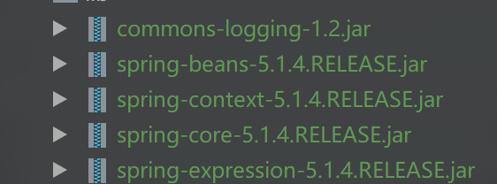
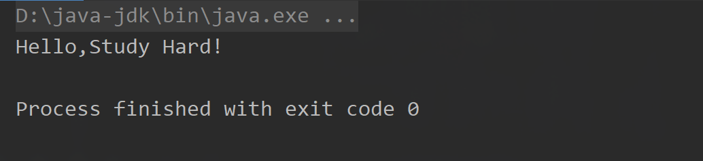

1. 打开idea创建一个Maven工程，不需要创建webapp

2. 创建lib文件夹，加入以下包，并在project结构中将lib包添加进libraries

   

3. 创建一个包cn.edu.xd.dao,里面建立1个接口和1个实现类

   ```java
   package cn.edu.xd.dao;
   
   /**
    * @author guipengfei
    * @date 2021/10/11 19:10
    */
   public interface TestDao {
       public void sayHello();
   }
   
   ```

   ```java
   package cn.edu.xd.dao;
   
   /**
    * @author guipengfei
    * @date 2021/10/11 19:11
    */
   public class TestDaoImpl implements TestDao {
       @Override
       public void sayHello() {
           System.out.println("Hello,Study Hard!");
       }
   }
   
   ```

4. 在resources文件夹下面建立applicationContext.xml文件

   ```xml
   <?xml version="1.0" encoding="UTF-8"?>
   <beans xmlns="http://www.springframework.org/schema/beans"
          xmlns:xsi="http://www.w3.org/2001/XMLSchema-instance"
          xsi:schemaLocation="http://www.springframework.org/schema/beans
           http://www.springframework.org/schema/beans/spring-beans.xsd">
       <!-- 将指定类TestDaoImpl配置给Spring，让Spring创建其实例 -->
       <bean id="test" class="cn.edu.xd.dao.TestDaoImpl" />
   </beans>
   
   ```

5. 测试

   ```java
   import cn.edu.xd.dao.TestDao;
   import org.springframework.context.ApplicationContext;
   import org.springframework.context.support.ClassPathXmlApplicationContext;
   
   /**
    * @author guipengfei
    * @date 2021/10/11 19:12
    */
   public class Test {
       public static void main(String[] args) {
           //初始化Spring容器ApplicationContext，加载配置文件
           ApplicationContext applicationContext=new ClassPathXmlApplicationContext("applicationContext.xml");
           //通过容器获取test实例
           TestDao testDao= (TestDao) applicationContext.getBean("test");
           testDao.sayHello();
       }
   }
   
   ```

6. 运行结果

